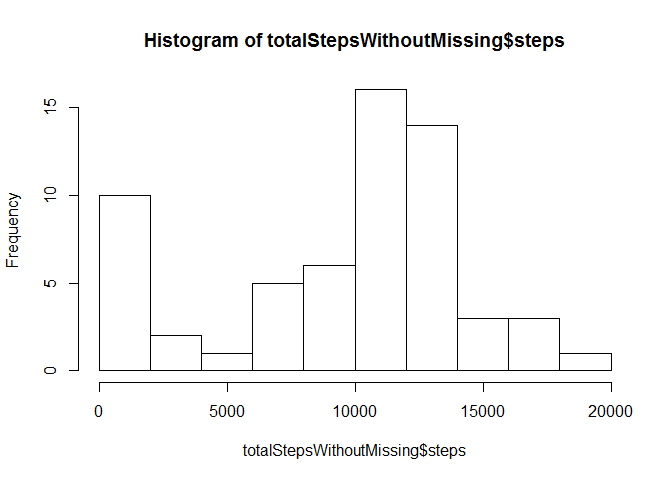
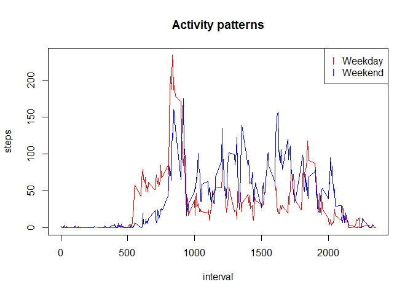

# Reproducible Research: Peer Assessment 1


## Loading and preprocessing the data

```r
unzip("activity.zip")
rawData = read.csv("activity.csv")
totalSteps <- aggregate(steps ~ date, data=rawData, sum, na.rm=TRUE)
```


## What is mean total number of steps taken per day?

```r
hist(totalSteps$steps, breaks=10)
```

 

```r
mean(totalSteps$steps)
```

```
## [1] 10766.19
```

```r
median(totalSteps$steps)
```

```
## [1] 10765
```

## What is the average daily activity pattern?

```r
stepsInterval<-aggregate(steps ~ interval, data=rawData, mean, na.rm=TRUE)
plot(steps~interval, data=stepsInterval, type="l")
```

 

```r
stepsInterval[which.max(stepsInterval$steps),]$interval
```

```
## [1] 835
```

## Imputing missing values

```r
sum(is.na(rawData$steps))
```

```
## [1] 2304
```
I'll use the mean of the 5 minutes interval as the missing value.

```r
dataWithoutMissing <- merge(rawData, stepsInterval, by="interval", suffixes=c("",".y"))
naIndex <- is.na(rawData$steps)
dataWithoutMissing$steps[naIndex] <- dataWithoutMissing$steps.y[naIndex]
dataWithoutMissing <- dataWithoutMissing[,c(1,2,3)]

totalStepsWithoutMissing <- aggregate(steps ~ date, data=dataWithoutMissing, sum, na.rm=TRUE)
hist(totalStepsWithoutMissing$steps, breaks=10)
```

 

```r
mean(totalStepsWithoutMissing$steps)
```

```
## [1] 9563.93
```

```r
median(totalStepsWithoutMissing$steps)
```

```
## [1] 11215.68
```

## Are there differences in activity patterns between weekdays and weekends?

```r
weekdays <- weekdays(as.Date(dataWithoutMissing$date))
dataWeekdays <- transform(dataWithoutMissing, day=weekdays)
dataWeekdays$wk <- ifelse(dataWeekdays$day %in% c("Saturday", "Sunday"),"weekend", "weekday")

stepsInterval2<-aggregate(steps ~ interval+wk, data=dataWeekdays, mean)
plot(steps~interval, data=stepsInterval2[stepsInterval2$wk=="weekday",], type="l", col="red")
points(steps~interval, data=stepsInterval2[stepsInterval2$wk=="weekend",], type="l", col = "blue")
title("Activity patterns")
legend("topright",legend=c("Weekday", "Weekend"), col=c("red","blue"), pch ="ll")
```

 
